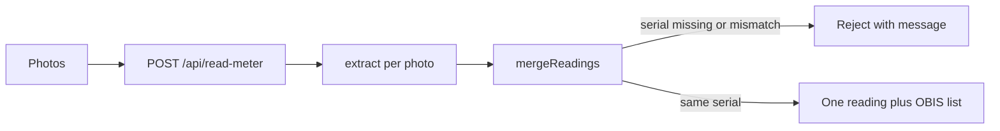

# PRD — Multi-image OBIS reading

**Overview:** Change the app from one photo and fixed JT/VT/NT fields to many photos of a single meter. Each photo is read into OBIS codes plus serial, manufacturer, and year; server-side code merges those results and rejects the submission when serial rules fail.

Code identifiers stay English. UI text stays Serbian. Database field mapping:

| DB / business | Code |
|---|---|
| `serijskiBroj` | `serialNumber` |
| `oznakaProizvodjaca` | `manufacturer` |
| `godinaProizvodnje` | `yearOfManufacture` |

---

## Product requirements (agreed)

1. **One meter per submission** — user may attach as many photos as they want (no fixed max in the product sense; see safety limits below).
2. **Serial on every photo** — if any photo has no readable serial, reject the whole submission with a message that the serial number could not be read.
3. **Single serial across photos** — after normalization, if photos disagree on serial, reject (not the same meter).
4. **OBIS only when printed** — model returns every OBIS code visible on the meter; do not invent codes (e.g. mechanical dials without OBIS labels).
5. **Tariffs via OBIS** — drop fixed JT/VT/NT form fields; higher/lower tariff values appear when codes such as `1.8.1` / `1.8.2` (or whatever is printed) are read.
6. **Values as one string** — each reading is the display string as printed (leading zeros preserved), not `{ integer, decimal }`.
7. **OBIS conflicts** — same code, different values across photos → merged field empty, marked for review.
8. **Manufacturer** — producer name only (EWG, Meter&Control, etc.). If unreadable, leave empty (does not reject).
9. **Year of manufacture** — four-digit year string; if unreadable, leave empty.
10. **Type code ≠ serial** — model must not treat meter type codes (e.g. `E311N2A20`) as serial.

---

## Architecture

One submission = one meter. Each photo → OpenRouter (vision + JSON schema). Merge + serial checks in application code, not in the model.

---

## Schema and prompt

In [lib/schema.ts](../lib/schema.ts), replace the fixed `readings.single` / `vt` / `nt` shape. **Per-image model output:**

- `isMeter`
- `serialNumber` (nullable)
- `manufacturer` (nullable; brand name only)
- `yearOfManufacture` (nullable; exactly four digits when present)
- `obis`: array of `{ code, value }` — only codes printed on that photo; `value` one string as printed (no unit suffix)

Remove from model schema: `meterKind`, `tariffType`, `visibleTariff`, old `readings` object.

**Merged API result** (built server-side, not returned by model):

- One `serialNumber`, `manufacturer`, `yearOfManufacture`
- One `obis` list; each item `{ code, value, review }` — on conflict `value: null`, `review: true`

**Prompt:** add [lib/prompts/v2.ts](../lib/prompts/v2.ts); do **not** edit v1. Register in [lib/prompts/index.ts](../lib/prompts/index.ts); allow `PROMPT_VERSION=v2` in [lib/config.ts](../lib/config.ts). Prompt must enforce: no invented OBIS, no guessed serial/manufacturer/year, type code ≠ serial.

---

## Merge rules

New pure module `lib/merge.ts` (Vitest):

| Rule | Outcome |
|---|---|
| Any photo `isMeter: false` or missing serial | Reject entire submission — serial could not be read |
| More than one distinct normalized serial | Reject — photos are not the same meter |
| Same OBIS code, same value (normalize spaces) | Keep once |
| Same OBIS code, different values | `value: null`, `review: true` |
| Manufacturer / year missing on all photos | Empty |
| Manufacturer / year disagree across photos | Empty + review |
| Code seen on one photo only | Include in merged list |

---

## API

[app/api/read-meter/route.ts](../app/api/read-meter/route.ts):

- Accept multiple files: `images` via `form.getAll("images")` (or equivalent).
- Preprocess each; `extractMeterReading` in parallel; then merge.
- Hard reject: `{ status: "error", code, message }` — no partial success.
- Conflicts / review flags: `{ status: "needs_review", ... }`.
- **Safety (not product cap):** e.g. max 15 photos, 10 MB per file; increase `maxDuration` for N parallel calls.
- Remove `previousReading` (tied to old VT/NT validation).

---

## UI

[app/page.tsx](../app/page.tsx): multi-select / add-more flow, list with remove per photo, previews, submit all. Show JSON result including errors and `review` flags (full form UI can follow PLAN phase 5).

---

## Eval, dataset, docs

- Update fixtures, [lib/validate.ts](../lib/validate.ts), [tests/validate.test.ts](../tests/validate.test.ts), [eval/scoring.ts](../eval/scoring.ts), [scripts/check-dataset.ts](../scripts/check-dataset.ts).
- Score: serial, manufacturer, year, per-OBIS code; extra OBIS vs ground truth = hallucination.
- Relabel [dataset/ground-truth.json](../dataset/ground-truth.json) (single entry) from existing notes — e.g. OBIS `15.8.1`, value as one string from `003703` + `86`, serial null, manufacturer EWG; log in [dataset/CHANGELOG.md](../dataset/CHANGELOG.md). Do not invent values.
- Eval remains one image per sample (null serial in GT is valid for eval; live API still rejects submissions with unreadable serial on any photo).
- Align schema section in [PLAN.md](../PLAN.md) with this PRD.
- **DoD:** `npm run check` green.

---

## Implementation checklist

- [ ] Schema + prompt v2 (v1 untouched)
- [ ] `lib/merge.ts` + tests
- [ ] Multi-image API + parallel extract
- [ ] Multi-image upload UI
- [x] Eval / ground truth / PLAN.md updates
- [ ] `npm run check`
